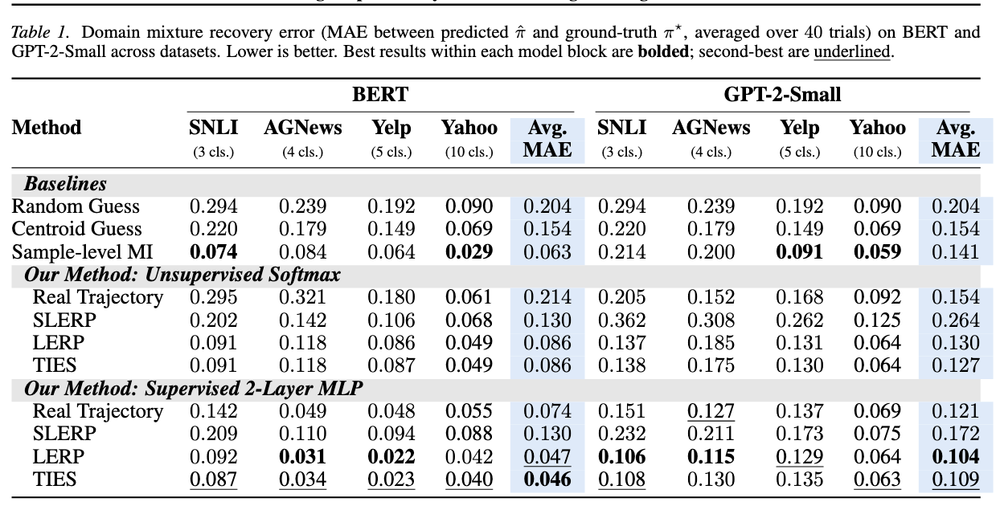

[](https://opensource.org/licenses/MIT)

# Domain mixture estimation

Official repositry for "WARP: Weight-Space Analysis for Recovering Training Data Portfolios" which is currenlty under review for ICML 2026 workshop. This work was submitted to the ICML 2026 Workshop on Weight-Space Symmetries. In our paper, we introduce WARP, a framework that recovers a fine-tuned model’s domain mixture directly from its released weights. WARP extracts geometric features and maps them to domain proportions using either a parameter-free softmax readout or a MLP projector trained on synthetic mixtures. In controlled experiments with BERT and GPT-2, WARP recovers domain mixtures with MAE as low as 0.048 and 0.117 respectively, outperforming membership inference and a variant with access to the true training trajectory, and remains accurate when recovering different training recipes.


Paper: link_to_be_put


## 🚀 Main Results



## Experiment Pipeline 

At a high level, the pipeline:
1. Selects a **seed subset** \(D\) of training data.
2. Builds a **fine-tuning subset** \(D'\) with a controlled class distribution.
3. Fine-tunes a base model into an **expert** (saving intermediate checkpoints along the way).
4. Constructs **pseudo-expert models** along the base → expert path (via interpolations).
5. Computes a per-example **alignment matrix** \(M\) using **last-layer gradients**.

This repository currently contains two experiment implementations:
- `bert/` — BERT sequence-classification experiments
- `gpt2/` — GPT-2 sequence-classification experiments

---

## 📁 Repository Structure

**Top-level utilities:**
- `data.py` — Dataset loading, filtering, subset selection (D and D'), and DataLoader creation

**Notebooks:**
- `experiment.ipynb` — ipynb file to start running the experiments
- `Baselines.ipynb` — ipynb file to generate the Baseline model comparisons
- `Visualizations.ipynb` — ipynb file for generating the visualization utilities e.g alignment matrix visualizations
- `kfold_pipeline.ipynb` — ipynb file for generating training point files, running Kfold validation and saving the results

**Model-specific pipelines:**

### `bert/`
- `bert_domain_distribution.py` — Main runner: loads config, prepares data, fine-tunes model, computes alignment matrices
- `bert_finetuning.py` — Fine-tunes BERT base → expert with intermediate checkpoint saving and saving converged and overtrained checkpoints 
- `bert_models.py` — Pseudo-expert creation via linear/quadratic interpolation and mergekit-based methods (SLERP/TIES/DELLA)
- `bert_alignment.py` — Computes alignment matrix using per-example last-layer gradients

### `gpt2/`
- `gpt2_domain_distribution.py` — Main runner for GPT-2 (same pipeline as BERT)
- `gpt2_finetuning.py` — Fine-tunes GPT-2 base → expert with intermediate checkpoint saving and saving converged and overtrained checkpoints 
- `gpt2_models.py` — Pseudo-expert creation via linear/quadratic interpolation and mergekit-based methods (SLERP/TIES/DELLA)
- `gpt2_alignment.py` — Computes alignment matrix using last-layer score gradients

**Legacy:**
- `old_code/` — Deprecated scripts kept for reference

---

## Quickstart

### Install dependencies

Using pip:

```bash
pip install -r requirements.txt
```

Or using conda:

```bash
conda env create -f enviroment.yml
conda activate <env-name>
```
---

## Running an experiment

Both pipelines are driven by a JSON config.

### BERT

```bash
python bert/bert_domain_distribution.py path/to/config.json
```

### GPT-2

```bash
python gpt2/gpt2_domain_distribution.py path/to/config.json
```

Outputs are written to:
- `output_dir = config.experiment_name`

Typical artifacts:
- `{experiment_name}/dataset_info.json` — indices for \(D\) and \(D'\)
- `{experiment_name}/theta_base_model.pt` — base weights
- `{experiment_name}/theta_exp_model.pt` — expert weights
- `{dataset}_{interpolation}_{proportionArr}/alignment_matrix_<interpolation>.npy` — alignment matrices
- `{dataset}_{interpolation}_{proportionArr}/lambda_statistics.json` — per-λ summary stats

---


## Example config (template)

```json
{
  "experiment_name": "my_experiment",
  "dataset": ["ag_news"],
  "model_name": ["bert-base-uncased"],
  "num_labels": 4,

  "batch_size": 16,
  "max_length": 256,
  "learning_rate": 2e-5,
  "num_epochs": 4,
  "optimizer": ["Adam"],

  "n_total": 5000,
  "n_finetune": 2500,
  "finetuning_source": ["original"],
  "proportionArr": [0.25, 0.25, 0.25, 0.25],

  "K": 15,
  "lambda_min": 0.05,
  "lambda_max": 0.95,

  "interpolations": ["linear", "quadratic", "slerp", "ties", "della","model_baseline"]
}
```

---


## Parameters

### Core Parameters

| Parameter | Type | Description | Supported Values |
|-----------|------|-------------|----------------|
| `experiment_name` | `string` | Output directory name for all artifacts 
| `dataset` | `string` | HuggingFace dataset identifier 
| `model_name` | `string` | Pre-trained model from HuggingFace | `"bert-base-uncased"`, `"gpt2"` |
| `num_labels` | `int` | Number of classification classes


### Training Hyperparameters

| Parameter | Type | Description | Supported Values |
|-----------|------|-------------|----------------|
| `batch_size` | `int` | Training batch size 
| `max_length` | `int` | Maximum sequence length (tokens)
| `learning_rate` | `float` | Optimizer learning rate 
| `num_epochs` | `int` | Number of fine-tuning epochs 
| `optimizer` | `string` | Optimization algorithm | `"Adam"`, `"SGD"` |


### Pseudo-Expert Generation

| Parameter | Type | Description | Range |
|-----------|------|-------------|-------|
| `K` | `int` | Number of pseudo-experts (interpolation points) | Typically `10` – `20` |
| `lambda_min` | `float` | Starting interpolation value (close to base model θ₀) | `0.0` – `0.1` |
| `lambda_max` | `float` | Ending interpolation value (close to expert model θₑ) | `0.9` – `1.0` |
| `interpolations` | `array<string>` | Methods for creating pseudo-experts (see below) | See table below |


#### Available `interpolations` Methods

| Method | Description | 
|--------|-------------|
| **`"linear"`** | Linear weight interpolation: θ(λ) = (1-λ)θ₀ + λθₑ |
| **`"quadratic"`** | Quadratic trajectory in weight space 
| **`"model_baseline"`** | Uses intermediate checkpoints saved during training 
| **`"slerp"`** | Spherical linear interpolation (geodesic path) 
| **`"ties"`** | TIES: Task Arithmetic via weight merging 
| **`"della"`** | DELLA: Adaptive weight averaging 


### Data Sampling Configuration

| Parameter | Type | Description | Range/Values |
|-----------|------|-------------|--------------|
| `n_total` | `int` | Size of **seed subset** \(D\) sampled from full training set 
| `n_finetune` | `int` | Size of **fine-tuning subset** \(D'\) | ≤ `n_total` |
| `finetuning_source` | `string` | Controls how \(D'\) is constructed (see below) | `"original"`, `"select"` |
| `proportionArr` | `array<float>` | Target class distribution for \(D'\) (must sum to 1.0) 

#### Understanding `finetuning_source`

This parameter determines the **sampling strategy** for constructing the fine-tuning subset \(D'\):

| Value | Description | Use Case |
|-------|-------------|----------|
| **`"original"`** | Sample \(D'\) **directly from the full training dataset** with target `proportionArr` distribution | ✅ Maximum data diversity<br>✅ \(D'\) is independent of seed subset \(D\)<br>✅ Use for standard fine-tuning experiments |
| **`"select"`** | Sample \(D'\) **from the seed subset** \(D\) with target `proportionArr` distribution | ✅ Ensures \(D' \subseteq D\)<br>✅ Useful when \(D\) serves as the test set for alignment computation<br>✅ Guarantees \(D \setminus D'\) is available for evaluation |

**Visual Comparison:**

```
Full Training Dataset (100k samples)
    │
    ├─→ [finetuning_source = "original"]
    │       │
    │       ├─→ Seed Subset D (5000 samples)      ← for alignment computation
    │       └─→ Fine-tuning D' (2500 samples)     ← sampled from full 100k
    │
    └─→ [finetuning_source = "select"]
            │
            └─→ Seed Subset D (5000 samples)
                    │
                    ├─→ Fine-tuning D' (2500 samples)  ← sampled from D
```


## 🧐 Todo
We welcome contributions and suggestions to the list!
- [] Complete ReadMe 
- [] Convert ipynb files to python scripts
- valudate quickstart 
- validate the outputs of running an expriment
- include that we need to save those inside those directories, and then run those files to get those results


## 📰 News
- [2025/05] Our paper is submitted to ICML workshop 2026: Weight-Space Symmetries!


## 📑 Citation
If you use the codes, please cite the following paper:
```bibtex
@misc{
      title={WARP: Weight-Space Analysis for Recovering Training Data Portfolios},
      author={Aditya Goyal and Tzu-Heng Huang and John Cooper and Frederic Sala},
      year={2026},
      eprint={to_be_put},
      archivePrefix={arXiv},
      primaryClass={to_be_put},
      url={link_to_be_put},
}

```

## Notes 

-  This is a research-grade codebase, and some parts may still be mid-refactor. If you run into issues that are hard to resolve, please reach out for further assistance.

-  If a dataset is not natively supported in the repo, make sure to use the dataset name in the format expected by Hugging Face’s load_dataset

-  By default, the repo uses the "text" column to generate tokens. If your dataset uses a different text column, update it accordingly in data.py [lines 246-252](data.py#L246-L252)

- to integrate another optimzier, pls change [lines 321-332](bert/bert_finetuning.py#L321-L332) for bert  or [lines 377-387](gpt2/gpt2_finetuning.py#L377-L387) for gpt2

- advanced interpolation methods (SLERP/TIES/DELLA) rely on `mergekit`. The repo’s `requirements.txt` includes a mergekit editable install; if mergekit import fails, those methods will be unavailable.

- uncomment the code for converged and overtrained model 

---

## License

This project is licensed under the [MIT License](LICENSE.md).

